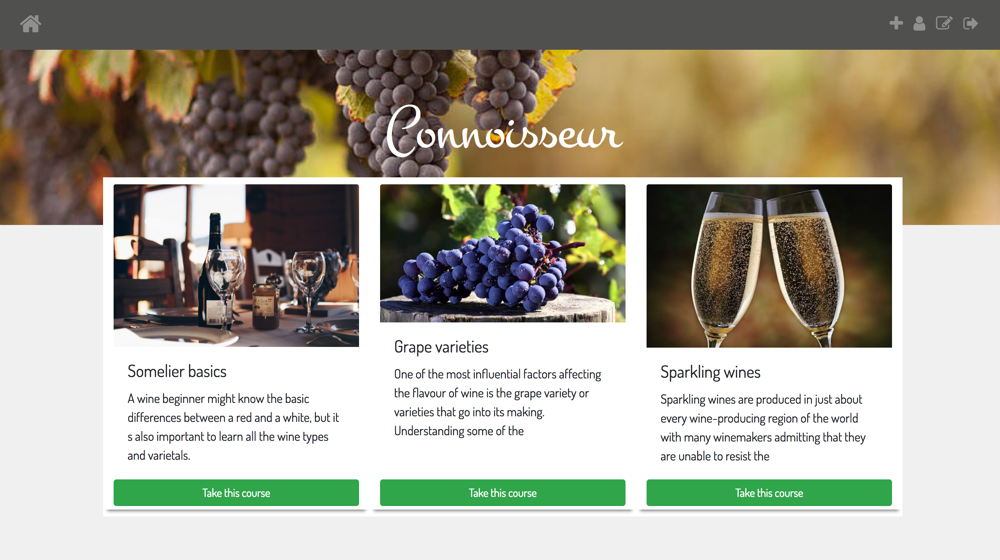
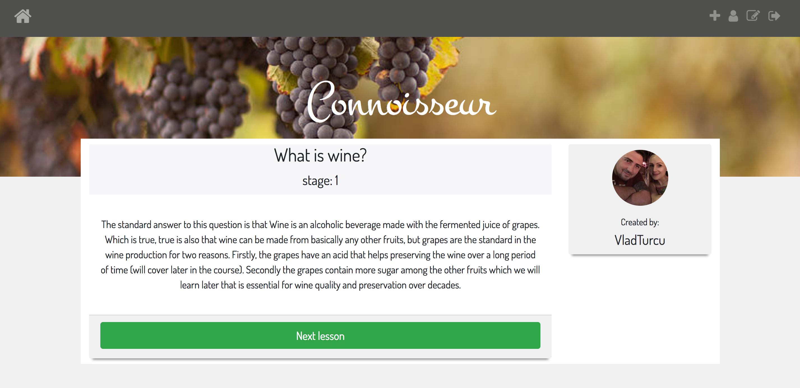
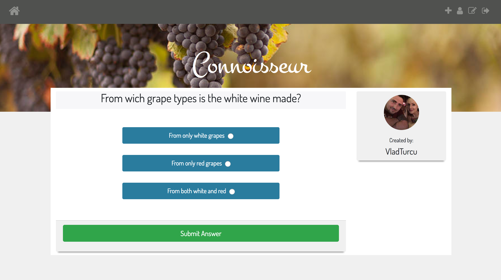

# <h1>Connoisseur</h1>

 - Is a wine self teaching app where user can enrich their knowledge about wines taking courses based on their level of knowledge. During the course they will be given questions regarding what they have learned. At the end of each course they will get a score of how well they did with the quitz!
 - It is a fully authenticated app using Express and ReactJS that was build using an Express API back-end and React for the front-end.

# <h4><em>Home page displaying available courses</em></h4>

# <h4><em>Sommelier Basics course displaying first lesson of the first stage</em></h4>

# <h4><em>Sommelier Basics course displaying question at the end of first stage</em></h4>

# <h4>Technologies used:</h4>
Reactjs, Express, MongoDB, Scss, BCrypt, JSON, JSON Web Token  HTML, Gulp, Bower, Bootstrap. Webpack

# <h3>Notes</h3>
The most challenging part of this project was TIME, and deciding which features to remove from my list in order to finish in time.
In the future I would like to add more courses and content, and would like to add email certification when user finish a course, a course admin review in that way the admin of the website can check if a course is right for this app before publishing and of course an admin area where the administrator of the website can remove, edit and publish courses added by users and same remove and edit users.
